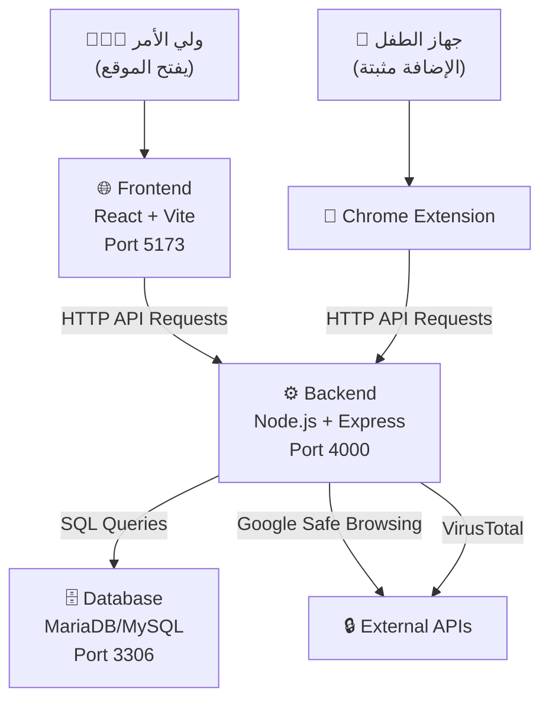
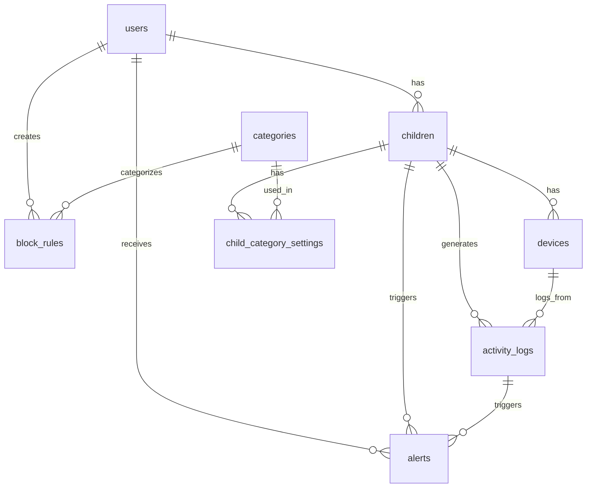

# شرح مشروع KidSafe بالتفصيل

---

## 1. البرامج والأدوات المستخدمة في التطوير

| الأداة | الاستخدام |
|---|---|
| **Visual Studio Code (VS Code)** | محرر الأكواد الرئيسي لكتابة جميع ملفات المشروع (Backend, Frontend, Extension) |
| **XAMPP** | يوفر خادم **Apache** + قاعدة بيانات **MariaDB/MySQL** + واجهة **phpMyAdmin** لإدارة قاعدة البيانات |
| **phpMyAdmin** | واجهة ويب تأتي مع XAMPP لإنشاء الجداول وتعديلها وتصدير/استيراد ملف SQL |
| **Node.js** | بيئة تشغيل JavaScript على السيرفر (لتشغيل الباك اند) |
| **npm** | مدير الحزم لتثبيت المكتبات اللي يحتاجها المشروع |
| **Google Chrome** | لتثبيت واختبار إضافة KidSafe Extension |
| **Git** | لإدارة الإصدارات والتعاون بين أعضاء الفريق |

---

## 2. لغات البرمجة المستخدمة

### JavaScript (اللغة الرئيسية)
- استخدمناها في **الأجزاء الثلاثة** من المشروع:
  - **Backend (السيرفر):** كتبنا API بـ JavaScript باستخدام بيئة Node.js ومكتبة Express
  - **Frontend (الموقع):** كتبنا واجهة المستخدم بـ JavaScript باستخدام مكتبة React
  - **Chrome Extension:** كتبنا الإضافة بـ JavaScript العادي (Vanilla JS)

### HTML
- لبناء هيكل صفحات الويب في الإضافة (صفحة الحظر [blocked.html](file:///e:/Saudi/Jazan/%D9%85%D8%B4%D8%A7%D8%B1%D9%8A%D8%B9%20%D8%AA%D8%AE%D8%B1%D8%AC/2026/Kidsafe/pahse%202/code/kidsafe-extension/blocked.html) وصفحة الإعدادات [options.html](file:///e:/Saudi/Jazan/%D9%85%D8%B4%D8%A7%D8%B1%D9%8A%D8%B9%20%D8%AA%D8%AE%D8%B1%D8%AC/2026/Kidsafe/pahse%202/code/kidsafe-extension/options.html))

### CSS
- لتنسيق وتصميم الصفحات (ملف [styles.css](file:///e:/Saudi/Jazan/%D9%85%D8%B4%D8%A7%D8%B1%D9%8A%D8%B9%20%D8%AA%D8%AE%D8%B1%D8%AC/2026/Kidsafe/pahse%202/code/web/src/styles.css) في الموقع + [blocked.css](file:///e:/Saudi/Jazan/%D9%85%D8%B4%D8%A7%D8%B1%D9%8A%D8%B9%20%D8%AA%D8%AE%D8%B1%D8%AC/2026/Kidsafe/pahse%202/code/kidsafe-extension/blocked.css) و [options.css](file:///e:/Saudi/Jazan/%D9%85%D8%B4%D8%A7%D8%B1%D9%8A%D8%B9%20%D8%AA%D8%AE%D8%B1%D8%AC/2026/Kidsafe/pahse%202/code/kidsafe-extension/options.css) في الإضافة)

### SQL
- لإنشاء قاعدة البيانات والجداول والعلاقات (ملف [kidsafe.sql](file:///e:/Saudi/Jazan/%D9%85%D8%B4%D8%A7%D8%B1%D9%8A%D8%B9%20%D8%AA%D8%AE%D8%B1%D8%AC/2026/Kidsafe/pahse%202/code/kidsafe.sql))

---

## 3. بنية المشروع (Architecture)

المشروع يتكون من **ثلاثة أجزاء رئيسية**:

```
KidSafe/
├── backend/          ← السيرفر (API)
├── web/              ← موقع لوحة التحكم (Dashboard)
├── kidsafe-extension/ ← إضافة متصفح كروم
└── kidsafe.sql       ← ملف قاعدة البيانات
```

---

### 3.1 الباك اند (Backend - السيرفر)

**المهمة:** يستقبل الطلبات من الموقع والإضافة ويتعامل مع قاعدة البيانات.

**التقنيات:**
- **Node.js** — بيئة تشغيل JavaScript
- **Express.js** — إطار عمل لبناء REST API
- **mysql2** — مكتبة للاتصال بقاعدة بيانات MySQL/MariaDB
- **bcryptjs** — لتشفير كلمات المرور
- **jsonwebtoken (JWT)** — لتوليد وتحقق من هوية المستخدم (التوثيق)
- **cors** — للسماح بالاتصال من الموقع والإضافة
- **dotenv** — لتحميل إعدادات البيئة من ملف [.env](file:///e:/Saudi/Jazan/%D9%85%D8%B4%D8%A7%D8%B1%D9%8A%D8%B9%20%D8%AA%D8%AE%D8%B1%D8%AC/2026/Kidsafe/pahse%202/code/backend/.env)
- **nodemailer** — لإرسال التنبيهات عبر البريد الإلكتروني

**الملفات الرئيسية:**

| الملف | الوظيفة |
|---|---|
| [src/index.js](file:///e:/Saudi/Jazan/%D9%85%D8%B4%D8%A7%D8%B1%D9%8A%D8%B9%20%D8%AA%D8%AE%D8%B1%D8%AC/2026/Kidsafe/pahse%202/code/backend/src/index.js) | نقطة بداية السيرفر — يشغّل Express ويربط جميع المسارات (routes) |
| [src/db.js](file:///e:/Saudi/Jazan/%D9%85%D8%B4%D8%A7%D8%B1%D9%8A%D8%B9%20%D8%AA%D8%AE%D8%B1%D8%AC/2026/Kidsafe/pahse%202/code/backend/src/db.js) | ينشئ اتصال (Pool) مع قاعدة البيانات باستخدام mysql2 |
| [src/routes/auth.js](file:///e:/Saudi/Jazan/%D9%85%D8%B4%D8%A7%D8%B1%D9%8A%D8%B9%20%D8%AA%D8%AE%D8%B1%D8%AC/2026/Kidsafe/pahse%202/code/backend/src/routes/auth.js) | مسارات تسجيل الدخول وإنشاء الحساب |
| [src/routes/children.js](file:///e:/Saudi/Jazan/%D9%85%D8%B4%D8%A7%D8%B1%D9%8A%D8%B9%20%D8%AA%D8%AE%D8%B1%D8%AC/2026/Kidsafe/pahse%202/code/backend/src/routes/children.js) | مسارات إدارة حسابات الأطفال وإضافة الأجهزة |
| [src/routes/blocklist.js](file:///e:/Saudi/Jazan/%D9%85%D8%B4%D8%A7%D8%B1%D9%8A%D8%B9%20%D8%AA%D8%AE%D8%B1%D8%AC/2026/Kidsafe/pahse%202/code/backend/src/routes/blocklist.js) | مسارات إدارة قواعد الحظر (إضافة/حذف/تعديل المواقع المحظورة) |
| [src/routes/logs.js](file:///e:/Saudi/Jazan/%D9%85%D8%B4%D8%A7%D8%B1%D9%8A%D8%B9%20%D8%AA%D8%AE%D8%B1%D8%AC/2026/Kidsafe/pahse%202/code/backend/src/routes/logs.js) | مسارات عرض سجلات النشاط |
| [src/routes/alerts.js](file:///e:/Saudi/Jazan/%D9%85%D8%B4%D8%A7%D8%B1%D9%8A%D8%B9%20%D8%AA%D8%AE%D8%B1%D8%AC/2026/Kidsafe/pahse%202/code/backend/src/routes/alerts.js) | مسارات عرض وإدارة التنبيهات |
| [src/routes/extension.js](file:///e:/Saudi/Jazan/%D9%85%D8%B4%D8%A7%D8%B1%D9%8A%D8%B9%20%D8%AA%D8%AE%D8%B1%D8%AC/2026/Kidsafe/pahse%202/code/backend/src/routes/extension.js) | مسارات خاصة بالإضافة (جلب قائمة الحظر، تسجيل الروابط، heartbeat) |
| [src/services/filtering.js](file:///e:/Saudi/Jazan/%D9%85%D8%B4%D8%A7%D8%B1%D9%8A%D8%B9%20%D8%AA%D8%AE%D8%B1%D8%AC/2026/Kidsafe/pahse%202/code/backend/src/services/filtering.js) | **محرك التصفية** — يفحص الروابط ضد القواعد + Google Safe Browsing + VirusTotal |
| [src/services/alerts.js](file:///e:/Saudi/Jazan/%D9%85%D8%B4%D8%A7%D8%B1%D9%8A%D8%B9%20%D8%AA%D8%AE%D8%B1%D8%AC/2026/Kidsafe/pahse%202/code/backend/src/services/alerts.js) | خدمة إرسال التنبيهات |
| [src/middleware/auth.js](file:///e:/Saudi/Jazan/%D9%85%D8%B4%D8%A7%D8%B1%D9%8A%D8%B9%20%D8%AA%D8%AE%D8%B1%D8%AC/2026/Kidsafe/pahse%202/code/backend/src/middleware/auth.js) | Middleware للتحقق من JWT Token |
| [src/utils/security.js](file:///e:/Saudi/Jazan/%D9%85%D8%B4%D8%A7%D8%B1%D9%8A%D8%B9%20%D8%AA%D8%AE%D8%B1%D8%AC/2026/Kidsafe/pahse%202/code/backend/src/utils/security.js) | دوال أمان مساعدة |
| [src/utils/validation.js](file:///e:/Saudi/Jazan/%D9%85%D8%B4%D8%A7%D8%B1%D9%8A%D8%B9%20%D8%AA%D8%AE%D8%B1%D8%AC/2026/Kidsafe/pahse%202/code/backend/src/utils/validation.js) | دوال التحقق من صحة البيانات |

**كيف يشتغل السيرفر:**
1. يتم تشغيله بأمر `npm run dev` فيعمل على **Port 4000**
2. يقرأ إعدادات الاتصال بقاعدة البيانات من ملف [.env](file:///e:/Saudi/Jazan/%D9%85%D8%B4%D8%A7%D8%B1%D9%8A%D8%B9%20%D8%AA%D8%AE%D8%B1%D8%AC/2026/Kidsafe/pahse%202/code/backend/.env)
3. يستقبل طلبات HTTP من الموقع والإضافة عبر REST API
4. يتحقق من الهوية باستخدام JWT Token
5. ينفذ العمليات على قاعدة البيانات ويرجع النتائج بصيغة JSON

---

### 3.2 الفرونت اند (Frontend - الموقع)

**المهمة:** لوحة تحكم للوالدين لإدارة حسابات الأطفال ومراقبة نشاطهم.

**التقنيات:**
- **React 18** — مكتبة بناء واجهات المستخدم
- **Vite** — أداة بناء سريعة للتطوير (بدل Webpack)
- **CSS عادي** — للتنسيق والتصميم

**الملفات الرئيسية:**

| الملف | الوظيفة |
|---|---|
| [index.html](file:///e:/Saudi/Jazan/%D9%85%D8%B4%D8%A7%D8%B1%D9%8A%D8%B9%20%D8%AA%D8%AE%D8%B1%D8%AC/2026/Kidsafe/pahse%202/code/web/index.html) | صفحة HTML الرئيسية اللي يشتغل عليها React |
| [src/main.jsx](file:///e:/Saudi/Jazan/%D9%85%D8%B4%D8%A7%D8%B1%D9%8A%D8%B9%20%D8%AA%D8%AE%D8%B1%D8%AC/2026/Kidsafe/pahse%202/code/web/src/main.jsx) | نقطة بداية React يربط التطبيق بـ DOM |
| [src/App.jsx](file:///e:/Saudi/Jazan/%D9%85%D8%B4%D8%A7%D8%B1%D9%8A%D8%B9%20%D8%AA%D8%AE%D8%B1%D8%AC/2026/Kidsafe/pahse%202/code/web/src/App.jsx) | المكوّن الرئيسي — يحتوي كل الصفحات والتنقل |
| [src/styles.css](file:///e:/Saudi/Jazan/%D9%85%D8%B4%D8%A7%D8%B1%D9%8A%D8%B9%20%D8%AA%D8%AE%D8%B1%D8%AC/2026/Kidsafe/pahse%202/code/web/src/styles.css) | ملف التنسيق الرئيسي |
| `src/api/` | ملفات الاتصال بـ Backend API |
| [vite.config.js](file:///e:/Saudi/Jazan/%D9%85%D8%B4%D8%A7%D8%B1%D9%8A%D8%B9%20%D8%AA%D8%AE%D8%B1%D8%AC/2026/Kidsafe/pahse%202/code/web/vite.config.js) | إعدادات Vite |

**كيف يشتغل الموقع:**
1. يتم تشغيله بأمر `npm run dev` فيعمل على **Port 5173**
2. يتواصل مع السيرفر (Backend) عبر HTTP requests
3. يعرض للوالد: تسجيل دخول، قائمة الأطفال، إضافة قواعد حظر، سجل النشاط، التنبيهات

---

### 3.3 إضافة كروم (Chrome Extension)

**المهمة:** تُثبّت على جهاز الطفل لحظر المواقع المحظورة وتسجيل كل المواقع اللي يزورها.

**التقنيات:**
- **Manifest V3** — أحدث إصدار من نظام إضافات كروم
- **JavaScript عادي (Vanilla JS)** — بدون أي مكتبات
- **Chrome APIs:**
  - `chrome.declarativeNetRequest` — لحظر المواقع
  - `chrome.webRequest` — لمراقبة وتسجيل الروابط
  - `chrome.storage` — لتخزين الإعدادات
  - `chrome.alarms` — لجدولة المزامنة الدورية

**الملفات:**

| الملف | الوظيفة |
|---|---|
| [manifest.json](file:///e:/Saudi/Jazan/%D9%85%D8%B4%D8%A7%D8%B1%D9%8A%D8%B9%20%D8%AA%D8%AE%D8%B1%D8%AC/2026/Kidsafe/pahse%202/code/kidsafe-extension/manifest.json) | ملف إعدادات الإضافة — يعرّف الأذونات والملفات |
| [background.js](file:///e:/Saudi/Jazan/%D9%85%D8%B4%D8%A7%D8%B1%D9%8A%D8%B9%20%D8%AA%D8%AE%D8%B1%D8%AC/2026/Kidsafe/pahse%202/code/kidsafe-extension/background.js) | **الملف الرئيسي** — Service Worker يعمل بالخلفية لـ: مزامنة قواعد الحظر، تسجيل الروابط، إرسال heartbeat |
| `options.html/js/css` | صفحة إعدادات الإضافة (API URL + Device Token) |
| `blocked.html/js/css` | صفحة تظهر للطفل عند محاولة زيارة موقع محظور |

**كيف تشتغل الإضافة:**
1. يتم تثبيتها في كروم عبر وضع المطور (Developer Mode → Load Unpacked)
2. يدخل ولي الأمر **Device Token** (اللي حصل عليه من الموقع) في إعدادات الإضافة
3. الإضافة تتصل بالسيرفر وتجلب قائمة المواقع المحظورة
4. تنشئ قواعد حظر باستخدام `declarativeNetRequest`
5. كل ما الطفل يزور موقع → الإضافة ترسل الرابط للسيرفر ليسجله
6. إذا الموقع محظور → يتم توجيه الطفل لصفحة [blocked.html](file:///e:/Saudi/Jazan/%D9%85%D8%B4%D8%A7%D8%B1%D9%8A%D8%B9%20%D8%AA%D8%AE%D8%B1%D8%AC/2026/Kidsafe/pahse%202/code/kidsafe-extension/blocked.html)
7. تعيد المزامنة مع السيرفر كل **15 دقيقة** تلقائياً

---

## 4. كيف تتكامل الأجزاء الثلاثة مع بعض



**سير العمل:**
1. **ولي الأمر** يسجل دخوله في الموقع → يضيف طفل → يُنشئ جهاز ويحصل على **Device Token**
2. يثبت **الإضافة** على جهاز الطفل ويدخل الـ Token
3. يضيف **قواعد حظر** (مثل: `instagram.com`, `youtube.com`)
4. **الإضافة** تجلب القواعد من السيرفر وتحظر المواقع
5. عند محاولة الطفل زيارة موقع محظور ← تظهر صفحة **"محتوى محظور"**
6. السيرفر يسجل كل النشاط ويرسل **تنبيه** لولي الأمر
7. السيرفر يفحص الروابط أيضاً عبر **Google Safe Browsing** و **VirusTotal** لكشف المواقع الخبيثة

---

## 5. قاعدة البيانات بالتفصيل

### 5.1 البرنامج المستخدم

- **XAMPP** — تم تشغيل خدمة MySQL (MariaDB 10.4) عبر لوحة تحكم XAMPP
- **phpMyAdmin** — تم استخدامه لإنشاء قاعدة البيانات `kidsafe` وجميع الجداول
- يمكن الوصول لـ phpMyAdmin عبر المتصفح على العنوان: `http://localhost/phpmyadmin`
- ملف قاعدة البيانات هو [kidsafe.sql](file:///e:/Saudi/Jazan/%D9%85%D8%B4%D8%A7%D8%B1%D9%8A%D8%B9%20%D8%AA%D8%AE%D8%B1%D8%AC/2026/Kidsafe/pahse%202/code/kidsafe.sql) ويمكن استيراده مباشرة عبر phpMyAdmin

### 5.2 خطوات إنشاء قاعدة البيانات

1. تشغيل **XAMPP** وتفعيل خدمتي **Apache** و **MySQL**
2. فتح **phpMyAdmin** من المتصفح (`http://localhost/phpmyadmin`)
3. إنشاء قاعدة بيانات جديدة باسم `kidsafe`
4. استيراد ملف [kidsafe.sql](file:///e:/Saudi/Jazan/%D9%85%D8%B4%D8%A7%D8%B1%D9%8A%D8%B9%20%D8%AA%D8%AE%D8%B1%D8%AC/2026/Kidsafe/pahse%202/code/kidsafe.sql) الذي يحتوي على جميع الجداول والبيانات
5. أو يدويًا: إنشاء كل جدول عبر tab "SQL" ولصق أوامر CREATE TABLE

### 5.3 الجداول (7 جداول)

#### 1. جدول `users` — المستخدمين (أولياء الأمور)
| العمود | النوع | الوصف |
|---|---|---|
| `id` | INT (PK, Auto) | معرف فريد |
| `email` | VARCHAR(255), UNIQUE | البريد الإلكتروني |
| `password_hash` | VARCHAR(255) | كلمة المرور مشفرة بـ bcrypt |
| `full_name` | VARCHAR(120) | الاسم الكامل |
| `alert_email` | VARCHAR(255) | بريد استقبال التنبيهات |
| `created_at` | TIMESTAMP | تاريخ الإنشاء |
| `updated_at` | TIMESTAMP | تاريخ التعديل |

#### 2. جدول `children` — الأطفال
| العمود | النوع | الوصف |
|---|---|---|
| `id` | INT (PK, Auto) | معرف فريد |
| `user_id` | INT (FK → users) | مرتبط بولي الأمر |
| `name` | VARCHAR(120) | اسم الطفل |
| `birth_year` | INT | سنة الميلاد |
| `created_at` | TIMESTAMP | تاريخ الإضافة |

#### 3. جدول `devices` — الأجهزة
| العمود | النوع | الوصف |
|---|---|---|
| `id` | INT (PK, Auto) | معرف فريد |
| `child_id` | INT (FK → children) | مرتبط بالطفل |
| `device_name` | VARCHAR(120) | اسم الجهاز |
| `api_token` | VARCHAR(64), UNIQUE | Token يُستخدم للتوثيق في الإضافة |
| `last_seen_at` | TIMESTAMP | آخر ظهور (heartbeat) |
| `created_at` | TIMESTAMP | تاريخ الإضافة |

#### 4. جدول `categories` — الفئات
| العمود | النوع | الوصف |
|---|---|---|
| `id` | INT (PK, Auto) | معرف فريد |
| `name` | VARCHAR(80) | اسم الفئة (Adult Content, Gambling, ...) |
| `description` | VARCHAR(255) | وصف الفئة |
| `default_blocked` | TINYINT(1) | هل محظورة افتراضياً؟ |

#### 5. جدول `block_rules` — قواعد الحظر
| العمود | النوع | الوصف |
|---|---|---|
| `id` | INT (PK, Auto) | معرف فريد |
| `user_id` | INT (FK → users) | ولي الأمر صاحب القاعدة |
| `category_id` | INT (FK → categories) | الفئة (اختياري) |
| `pattern` | VARCHAR(255) | النمط (اسم الدومين أو كلمة مفتاحية) |
| `rule_type` | ENUM(domain, keyword, regex) | نوع القاعدة |
| `is_active` | TINYINT(1) | هل مفعّلة؟ |
| `created_at` | TIMESTAMP | تاريخ الإنشاء |

#### 6. جدول `activity_logs` — سجل النشاط
| العمود | النوع | الوصف |
|---|---|---|
| `id` | INT (PK, Auto) | معرف فريد |
| `child_id` | INT (FK → children) | الطفل |
| `device_id` | INT (FK → devices) | الجهاز |
| `url` | TEXT | الرابط المُزار |
| `hostname` | VARCHAR(255) | اسم الموقع |
| `verdict` | ENUM(allowed, blocked, malicious) | الحكم |
| `reason` | VARCHAR(255) | سبب الحكم |
| `created_at` | TIMESTAMP | وقت الزيارة |

#### 7. جدول `child_category_settings` — إعدادات الفئات لكل طفل
| العمود | النوع | الوصف |
|---|---|---|
| `child_id` | INT (PK, FK → children) | الطفل |
| `category_id` | INT (PK, FK → categories) | الفئة |
| `is_blocked` | TINYINT(1) | هل محظورة لهذا الطفل؟ |

### 5.4 العلاقات بين الجداول (Relationships)



- **users → children**: كل ولي أمر يمكن أن يكون لديه عدة أطفال (One-to-Many)
- **children → devices**: كل طفل يمكن أن يكون لديه عدة أجهزة (One-to-Many)
- **users → block_rules**: كل ولي أمر ينشئ قواعد حظر خاصة به (One-to-Many)
- **children → activity_logs**: كل طفل له سجل نشاط (One-to-Many)
- **devices → activity_logs**: كل سجل نشاط مرتبط بجهاز محدد (One-to-Many)
- **activity_logs → alerts**: التنبيهات تُنشأ من سجلات النشاط المحظورة (One-to-Many)
- **children ↔ categories**: علاقة Many-to-Many عبر جدول `child_category_settings`

### 5.5 الأمان في قاعدة البيانات

- كلمات المرور **لا تُخزّن كنص عادي** بل تُشفّر باستخدام **bcrypt** قبل التخزين
- **ON DELETE CASCADE**: عند حذف مستخدم يتم حذف جميع البيانات المرتبطة به تلقائياً
- **ON DELETE SET NULL**: عند حذف جهاز، تبقى سجلات النشاط لكن يصبح `device_id = NULL`

---

## 6. كيف يتم ربط الأكواد مع قاعدة البيانات

### الاتصال بقاعدة البيانات
```javascript
// ملف: backend/src/db.js
import mysql from "mysql2/promise";
const pool = mysql.createPool({
  host: process.env.DB_HOST,    // localhost
  user: process.env.DB_USER,    // kidsafe
  password: process.env.DB_PASSWORD,
  database: process.env.DB_NAME, // kidsafe
  port: 3306
});
```
- نستخدم مكتبة `mysql2` للاتصال بقاعدة البيانات
- الإعدادات تُقرأ من ملف [.env](file:///e:/Saudi/Jazan/%D9%85%D8%B4%D8%A7%D8%B1%D9%8A%D8%B9%20%D8%AA%D8%AE%D8%B1%D8%AC/2026/Kidsafe/pahse%202/code/backend/.env) (لأنها حساسة ولا نضعها في الكود مباشرة)
- نستخدم **Connection Pool** (تجمع اتصالات) بدل اتصال واحد لأداء أفضل

### مثال على استخدام قاعدة البيانات في Route
```javascript
// عند تسجيل الدخول
const [rows] = await pool.execute(
  "SELECT * FROM users WHERE email = ?", [email]
);
// الاستعلام يرجع بيانات المستخدم من جدول users
```

---

## 7. كيف يتم تشغيل المشروع (خطوات التشغيل)

### الخطوة 1: تشغيل قاعدة البيانات
```
1. افتح XAMPP
2. شغّل Apache و MySQL
3. افتح phpMyAdmin (http://localhost/phpmyadmin)
4. أنشئ قاعدة بيانات باسم "kidsafe"
5. استورد ملف kidsafe.sql
```

### الخطوة 2: تشغيل الباك اند
```bash
cd backend
npm install       # تثبيت المكتبات
npm run dev       # تشغيل السيرفر على Port 4000
```

### الخطوة 3: تشغيل الموقع
```bash
cd web
npm install       # تثبيت المكتبات
npm run dev       # تشغيل الموقع على Port 5173
```

### الخطوة 4: تثبيت الإضافة
```
1. افتح Chrome
2. اذهب إلى chrome://extensions
3. فعّل "Developer mode"
4. اضغط "Load unpacked"
5. اختر مجلد kidsafe-extension
```

---

## 8. ملخص التقنيات

| الجزء | اللغة | الإطار/الأداة | المهمة |
|---|---|---|---|
| Backend | JavaScript | Node.js + Express | API + منطق الحظر + قاعدة البيانات |
| Frontend | JavaScript + JSX | React + Vite | لوحة تحكم ولي الأمر |
| Extension | JavaScript | Chrome APIs (Manifest V3) | حظر المواقع + تسجيل النشاط |
| Database | SQL | MariaDB + phpMyAdmin | تخزين البيانات |
| أمان | — | bcrypt + JWT | تشفير كلمات المرور + توثيق الجلسات |
| فحص الروابط | — | Google Safe Browsing + VirusTotal | كشف المواقع الخبيثة |
